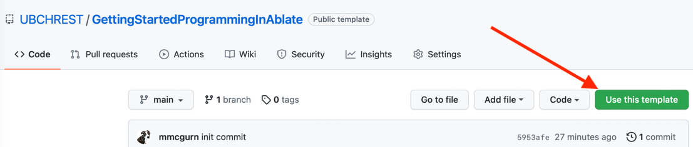

The first day is about getting access and the tool you will need for development.  Before learning about c/c++ it is important to understand version control and specifically git. Version control is a fundamental aspect of successful software development regardless of the target product or development team.  ABLATE is using Git for version control hosted on [Github.com](https://github.com/UBCHREST/ablate).  Git and the associated workflows define how people develop, document, test, and contribute code to the project.  If you are new to Git or unsure/unconvinced why we are using version control it is recommended that you watch the [Git Introduction by Alicia Klinvex](https://www.youtube.com/watch?v=0dkvuC8MzPI) presented at Argonne Training Program on Extreme-Scale Computing 2017.

Complete the [Learn Git Branching](https://learngitbranching.js.org) interactive tutorial to help learn Git.

<iframe width="560" height="315" src="https://www.youtube-nocookie.com/embed/0dkvuC8MzPI" title="YouTube video player" frameborder="0" allow="accelerometer; autoplay; clipboard-write; encrypted-media; gyroscope; picture-in-picture" allowfullscreen></iframe>

**Goals**
1. Use the [CodingAblate Repo Template](https://github.com/UBCHREST/codingAblate) to create your own repo.  This is done with the _Use this Template_ button on the [CodingAblate Repo Template](https://github.com/UBCHREST/codingAblate).
  
2. Download [CLion](https://www.jetbrains.com/clion/) and signup for an academic account (if applicable).
    - If using Windows, it is recommended that CLion be installed under/launched from Ubuntu using WSL2.  Step-by-step installation directions for WSL2 can be found in [Microsoft's Site](https://docs.microsoft.com/en-us/windows/wsl/tutorials/gui-apps).  Then install CLion under Ubuntu using the linux install directions.
3. Clone new Getting Started Projects from GitHub using CLion and run the day1 executable. 
